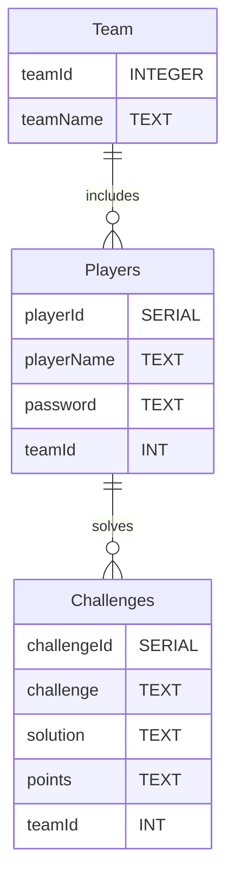

# Database Diagram

```mermaid
erDiagram
    Team {
        teamId INTEGER
        teamName TEXT
    }

    Players {
        playerId SERIAL
        playerName TEXT
        password TEXT
        teamId INT
    }

    Challenges {
        challengeId SERIAL
        challenge TEXT
        solution TEXT
        points TEXT
        teamId INT
    }

    Team    ||--o{ Players    : "includes"
    Players ||--o{ Challenges : "solves"
```
