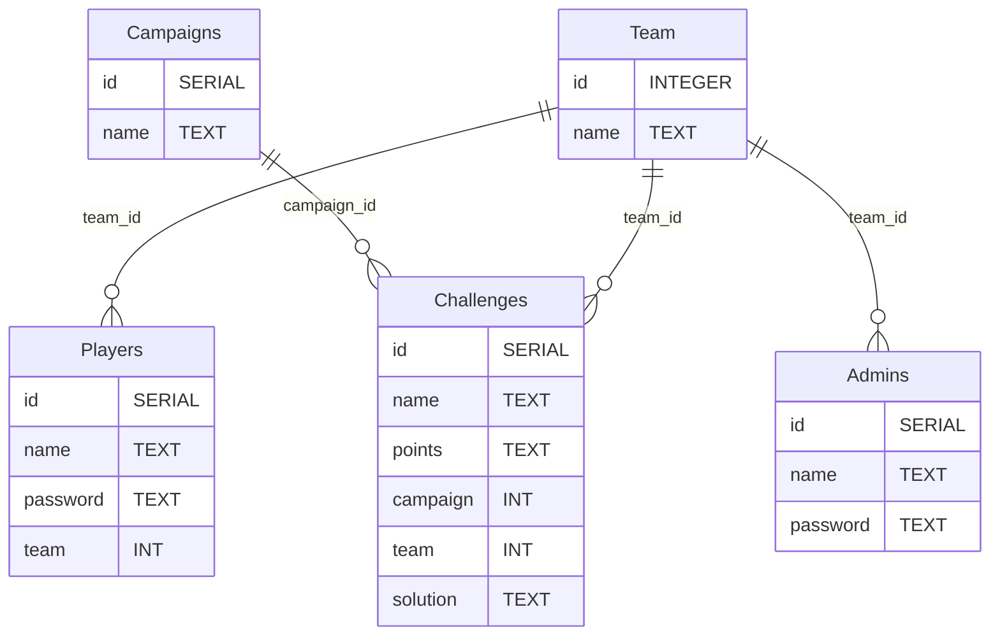

# Database Diagram

```mermaid
erDiagram
    Team {
        id INTEGER
        name TEXT
    }

    Players {
        id SERIAL
        name TEXT
        password TEXT
        team INT
    }

    Campaigns {
        id SERIAL
        name TEXT
    }

    Challenges {
        id SERIAL
        name TEXT
        points TEXT
        campaign INT
        team INT
        solution TEXT
    }

    Admins {
        id SERIAL
        name TEXT
        password TEXT
    }

    Team ||--o{ Players : "team_id"
    Campaigns ||--o{ Challenges : "campaign_id"
    Team ||--o{ Challenges : "team_id"
    Team ||--o{ Admins : "team_id"
```